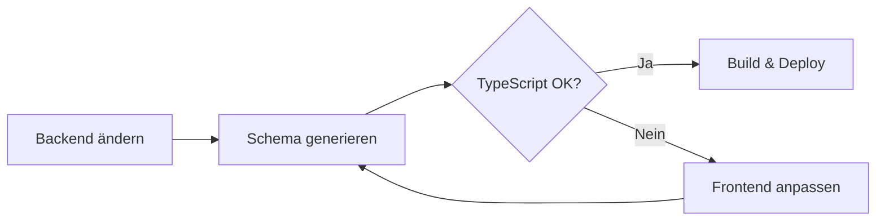

# OpenAPI TypeScript Codegen Guide

Automatische TypeScript-Typen aus dem FastAPI Backend-Schema generieren.

## 🎯 Ziel

**Backend-API ändert sich → TypeScript-Compiler warnt → Keine Runtime-Fehler mehr!**

## 📦 Installation

Bereits installiert:
```bash
npm install openapi-fetch              # Runtime: Type-safe API client
npm install -D openapi-typescript      # Dev: Schema → TypeScript Generator
```

## 🚀 Quick Start

### 1. Backend starten

```bash
cd backend
uvicorn app.main:app --reload --port 8000
```

Prüfe: http://localhost:8000/docs sollte erreichbar sein.

### 2. TypeScript-Typen generieren

```bash
cd frontend
npm run openapi:generate
```

✅ Erstellt: `src/api/generated/schema.ts` (ca. 500-2000 Zeilen)

### 3. In deinem Code nutzen

```typescript
// ❌ Alt: Manuelle Typen (offers.ts)
import { listOffers, type Offer } from './api/offers'

// ✅ Neu: Automatische Typen (offers-typesafe.ts)
import { listOffers, type Offer } from './api/offers-typesafe'

// API-Call bleibt gleich - aber jetzt mit 100% Type-Safety!
const offers = await listOffers({ status: 'new' })
```

## 📜 Verfügbare Scripts

### `npm run openapi:generate`

Einmalige Generierung aus http://localhost:8000/openapi.json

```bash
npm run openapi:generate
# ✅ Erstellt src/api/generated/schema.ts
```

### `npm run openapi:generate:prod`

Generierung von Production-Backend (mit ENV-Variable)

```bash
API_URL=https://api.margin-hunter.com npm run openapi:generate:prod
```

### `npm run openapi:watch`

Watch-Modus: Regeneriert automatisch bei Backend-Änderungen

```bash
npm run openapi:watch
# 🔄 Läuft im Hintergrund und aktualisiert bei Schema-Änderungen
```

### `npm run typecheck`

TypeScript-Compiler ohne Build

```bash
npm run typecheck
# ✅ Prüft nur Typen, erstellt keine Build-Dateien
```

### `npm run typecheck:strict`

Generiert Schema UND prüft Typen (für CI/CD)

```bash
npm run typecheck:strict
# 1. Generiert schema.ts
# 2. Prüft TypeScript-Typen
# ❌ Bricht bei Type-Errors ab
```

## 🗂️ Dateistruktur

```
frontend/src/api/
├── generated/
│   ├── schema.ts           ← Automatisch generiert (NICHT bearbeiten!)
│   └── README.md
│
├── client.ts               ← Alt: Manueller API-Client
├── client-typesafe.ts      ← Neu: Type-safe mit openapi-fetch
│
├── offers.ts               ← Alt: Manuelle Typen
├── offers-typesafe.ts      ← Neu: Automatische Typen
│
├── products.ts             ← Alt: Manuelle Typen
└── products-typesafe.ts    ← Neu: Automatische Typen
```

## 🔄 Migration: Alt → Neu

### Schritt 1: Schema generieren

```bash
# Backend muss laufen!
npm run openapi:generate
```

### Schritt 2: Imports umstellen

```typescript
// ❌ Vorher
import { useOffers } from '../hooks/useOffers'
// verwendet intern: api/offers.ts

// ✅ Nachher - useOffers Hook anpassen:
// In hooks/useOffers.ts:
import { listOffers } from '../api/offers-typesafe'  // ← Neu!
```

### Schritt 3: Typen prüfen

```bash
npm run typecheck
# ✅ Keine Fehler? Migration erfolgreich!
# ❌ Fehler? Backend-Schema hat sich geändert
```

## 📊 Vorher / Nachher Vergleich

### ❌ Vorher: Manuelle Typen (offers.ts)

```typescript
// Manuelle Type-Definition - kann veraltet sein!
export type Offer = {
  id: number
  title: string
  price: number
  status: string  // ← Welche Werte sind erlaubt? 🤷
}

// Manuelles Typing - kann falsch sein!
export function listOffers(filters: OfferListFilters = {}) {
  const query = buildQuery(filters)
  return apiClient.get<Offer[]>(`/offers${query}`)
  //                     ^^^^^^^ Trust me bro!
}
```

**Probleme:**
- ❌ Typen können vom Backend abweichen
- ❌ Keine Warnung bei Backend-Änderungen
- ❌ Runtime-Errors: `undefined is not a function`
- ❌ Manuelles Pflegen = Fehleranfällig

### ✅ Nachher: Automatische Typen (offers-typesafe.ts)

```typescript
import type { components } from './generated/schema'

// Kommt DIREKT aus Backend - immer aktuell!
export type Offer = components['schemas']['Offer']

// Type-safe API Client - TypeScript kennt alle Endpoints
export async function listOffers(filters: OfferListFilters = {}) {
  return fetchOrThrow(
    apiClient.GET('/offers', {
      params: { query: filters },
    })
  )
  // ✅ Response-Type ist automatisch korrekt
  // ✅ Compiler prüft Endpoint-Existenz
  // ✅ Autocomplete für alle Parameter
}
```

**Vorteile:**
- ✅ Typen sind **immer** synchron mit Backend
- ✅ TypeScript-Error bei API-Änderungen
- ✅ Autocomplete für alle Endpoints
- ✅ Keine manuellen Typen pflegen
- ✅ Compile-Time statt Runtime-Errors

## 🎯 Beispiel: Backend-Änderung wird sofort erkannt

### Backend ändert Offer-Model

```python
# backend/app/models/offer.py
class OfferStatusUpdate(BaseModel):
    status: Literal["new", "open", "closed"]
    # ↑ "ignored" und "contacted" wurden entfernt!
```

### Dein Frontend-Code

```typescript
// Nach npm run openapi:generate
updateOfferStatus(1, { status: "ignored" })
//                              ^^^^^^^^
// ❌ TypeScript-Error:
// Type '"ignored"' is not assignable to type '"new" | "open" | "closed"'
```

✅ **Du siehst den Fehler SOFORT beim Compile!**  
✅ **Keine Runtime-Errors in Production!**

## 🔧 Integration mit React Query

### Hooks mit generierten Typen

```typescript
// hooks/useOffers.ts
import { useQuery } from '@tanstack/react-query'
import { listOffers, type Offer } from '../api/offers-typesafe'

export function useOffers(filters: OfferListFilters) {
  return useQuery<Offer[], Error>({
    queryKey: ['offers', filters],
    queryFn: () => listOffers(filters),
    // ✅ Offer ist automatisch korrekt typisiert!
  })
}
```

### In Komponenten verwenden

```typescript
// pages/Offers.tsx
import { useOffers } from '../hooks/useOffers'

export function OffersPage() {
  const { data } = useOffers({ status: 'new' })
  
  return (
    <div>
      {data?.map((offer) => (
        <div key={offer.id}>
          {/* ✅ TypeScript kennt alle Felder von Offer */}
          <h3>{offer.title}</h3>
          <p>{offer.price} €</p>
          <span>{offer.status}</span>
          {/* ❌ offer.nonExistent → TypeScript-Error! */}
        </div>
      ))}
    </div>
  )
}
```

## 🤖 CI/CD: GitHub Actions

### Workflow prüft automatisch Type-Safety

Siehe: `.github/workflows/frontend-typecheck.yml`

**Was passiert:**
1. ✅ Backend wird gestartet
2. ✅ OpenAPI-Schema wird abgerufen
3. ✅ TypeScript-Typen werden generiert
4. ✅ Frontend wird kompiliert
5. ❌ Build schlägt fehl bei Type-Errors

**Ergebnis:**
- Backend-Änderung ohne Frontend-Anpassung → PR wird abgelehnt
- Entwickler muss Frontend anpassen → Type-Safety garantiert

### Manuell ausführen

```bash
# Simuliert GitHub Actions lokal
npm run typecheck:strict

# Entspricht:
# 1. npm run openapi:generate
# 2. tsc -b --noEmit
```

## 🐛 Troubleshooting

### Fehler: "fetch failed" / ECONNREFUSED

**Problem:** Backend läuft nicht auf Port 8000

```bash
# Lösung: Backend starten
cd backend
uvicorn app.main:app --reload --port 8000

# In anderem Terminal:
cd frontend
npm run openapi:generate
```

### Fehler: "schema.ts not found"

**Problem:** Schema wurde noch nicht generiert

```bash
# Lösung:
npm run openapi:generate
```

### Fehler: TypeScript-Compile-Fehler nach Schema-Update

**Problem:** Backend-API hat sich geändert, Frontend-Code ist veraltet

**Lösung:**
1. Prüfe die TypeScript-Fehler (`npm run typecheck`)
2. Passe Frontend-Code an neue API an
3. Optional: Frage Backend-Team nach Breaking Changes

### Schema ist veraltet

**Problem:** Backend wurde geändert, aber schema.ts ist alt

```bash
# Lösung: Neu generieren
npm run openapi:generate

# Oder automatisch bei Änderungen:
npm run openapi:watch
```

## 📝 Best Practices

### ✅ DO

- **Generiere Schema vor jedem Build**: `npm run typecheck:strict` in CI/CD
- **Nutze type-safe APIs**: Importiere aus `*-typesafe.ts` Dateien
- **Versionskontrolle**: Committe `schema.ts` optional (siehe unten)
- **Dokumentiere API-Changes**: Breaking Changes in Changelog erwähnen

### ❌ DON'T

- **NICHT** `schema.ts` manuell bearbeiten (wird überschrieben!)
- **NICHT** Typen aus `schema.ts` kopieren (immer über `components` importieren)
- **NICHT** alte und neue API-Clients mischen

## 🤔 FAQ

### Sollte `schema.ts` in Git committed werden?

**Option A: Ja** (empfohlen für kleine Teams)
- ✅ Frontend ist sofort lauffähig nach `git clone`
- ✅ Kein Backend-Setup für Frontend-Entwicklung nötig
- ❌ Merge-Konflikte bei gleichzeitigen Backend-Änderungen

**Option B: Nein** (empfohlen für große Teams)
- ✅ Keine Merge-Konflikte
- ✅ Immer aktuelles Schema (regeneriert bei jedem Build)
- ❌ Backend muss laufen für Frontend-Entwicklung

### Unsere Empfehlung für Margin Hunter:

**Committe `schema.ts`** + füge Build-Check hinzu:

```bash
# In CI/CD:
npm run openapi:generate
git diff --exit-code src/api/generated/schema.ts
# ❌ Fails if schema changed but not committed
```

### Wie oft sollte ich das Schema regenerieren?

- **Bei jedem Backend-Pull**: Nach `git pull` im Backend
- **Vor jedem PR**: Um Inkompatibilitäten zu finden
- **In CI/CD**: Automatisch bei jedem Build
- **Optional**: `npm run openapi:watch` während Development

### Was ist mit anderen API-Clients (Scraper, System)?

Gleiche Migration:

```typescript
// api/scraper-typesafe.ts
import { apiClient, fetchOrThrow } from './client-typesafe'
import type { components } from './generated/schema'

export type ScraperStatus = components['schemas']['ScraperStatus']

export async function getScraperStatus() {
  return fetchOrThrow(apiClient.GET('/scraper/status'))
}
```

## 🎉 Zusammenfassung

### Was haben wir erreicht?

✅ **Automatische TypeScript-Typen** aus FastAPI-Schema  
✅ **Compile-Time Errors** bei API-Änderungen  
✅ **Keine Runtime-Errors** mehr durch API-Inkompatibilität  
✅ **Autocomplete** für alle Endpoints und Parameter  
✅ **CI/CD Integration** mit GitHub Actions  
✅ **Zero-Maintenance** - Typen aktualisieren sich automatisch  

### Workflow



### Next Steps

1. ✅ Starte Backend: `uvicorn app.main:app --reload`
2. ✅ Generiere Schema: `npm run openapi:generate`
3. ✅ Teste Typen: `npm run typecheck`
4. ✅ Migriere einen Hook nach `*-typesafe.ts`
5. ✅ Committe & Pushe → GitHub Actions prüft Type-Safety

---

**Happy Type-Safe Coding! 🎉**

Bei Fragen: Siehe [openapi-typescript Docs](https://openapi-ts.dev/)

